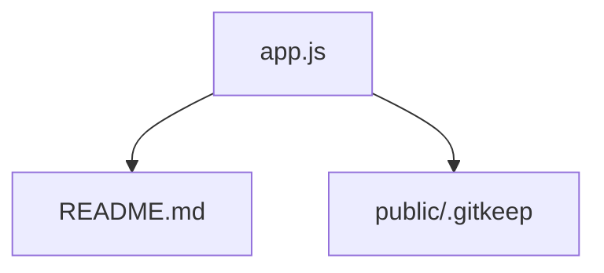

```markdown
# Codebase Genius return: node-hello-world

## Project Overview

This project is a basic "Hello World" application built with Node.js, designed to verify and demonstrate Node.js support.

## Installation and Usage

This is a Node.js project. To run it:

1.  Ensure you have Node.js installed.
2.  Clone the repository.
3.  Navigate to the project directory.
4.  Run `npm install` to install dependencies (if any).
5.  Run the application using `node app.js`.
6.  Access the application in your web browser.

## Repository Insights

| Language   | File Count |
|------------|------------|
| javascript | 1          |
| markdown   | 1          |
| text       | 1          |

## High-Level Architecture



## File-by-File Analysis

### app.js

*   **Path:** app.js
*   **Summary:** The file creates an HTTP server that listens on a specified port and responds with "Hello, World!".
*   **Symbols:** http, port, require, process, env, createServer, request, response, writeHead, end, console, log

### README.md

*   **Path:** README.md
*   **Summary:** The file is a simple Node.js "Hello World" application for testing Node.js support.
*   **Symbols:** Node, js, A

### public/.gitkeep

*   **Path:** public/.gitkeep
*   **Summary:** Empty file or placeholder
*   **Symbols:**
```