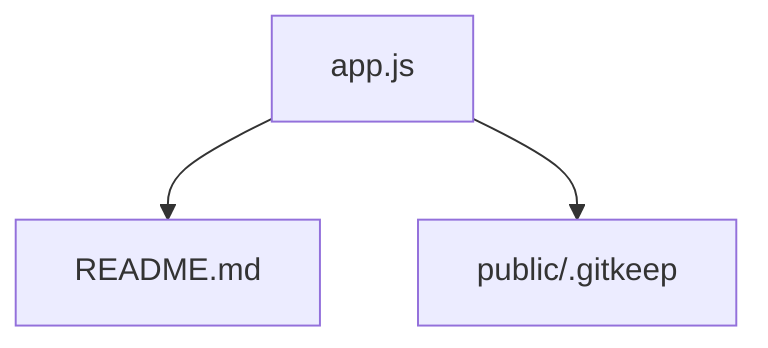

```markdown
# Codebase Genius Report: node-hello-world

## Project Overview

This project is a basic "Hello World" application for testing Node.js support in cloud environments.

## Installation and Usage

To install and run this project, you'll need Node.js and npm (Node Package Manager) installed on your system.

1.  Clone the repository.
2.  Navigate to the project directory.
3.  Run `node app.js` to start the server.

The application will then be accessible in your web browser.

## Repository Insights

| Language   | File Count |
| :--------- | :--------- |
| javascript | 1          |
| markdown   | 1          |
| text       | 1          |

## High-Level Architecture



## File-by-File Analysis

### app.js

*   **Path:** app.js
*   **Summary:** The file creates an HTTP server that listens on a specified port and responds with "Hello, World!".
*   **Symbols:** http, port, request, response, createServer, writeHead, end, listen, console, log

### README.md

*   **Path:** README.md
*   **Summary:** The file contains a simple Node.js Hello World application description.
*   **Symbols:** Node, js, A

### public/.gitkeep

*   **Path:** public/.gitkeep
*   **Summary:** Empty file or placeholder
*   **Symbols:**
```